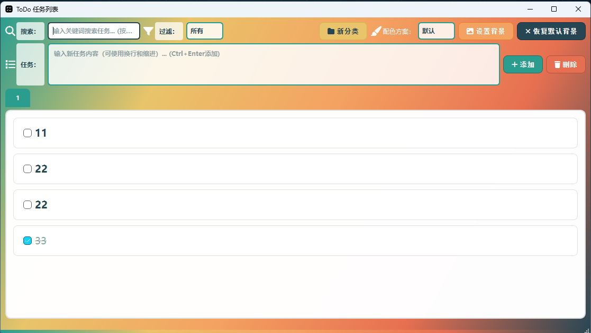
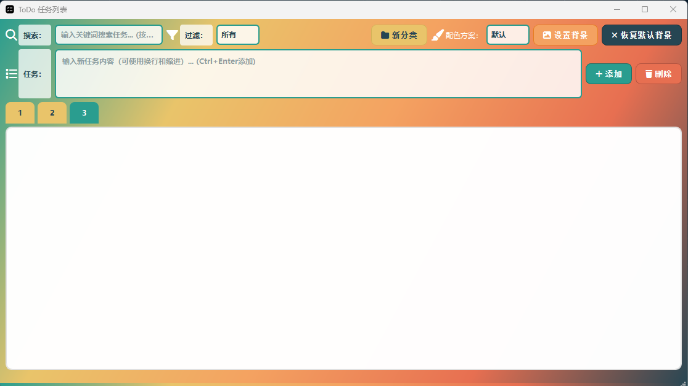
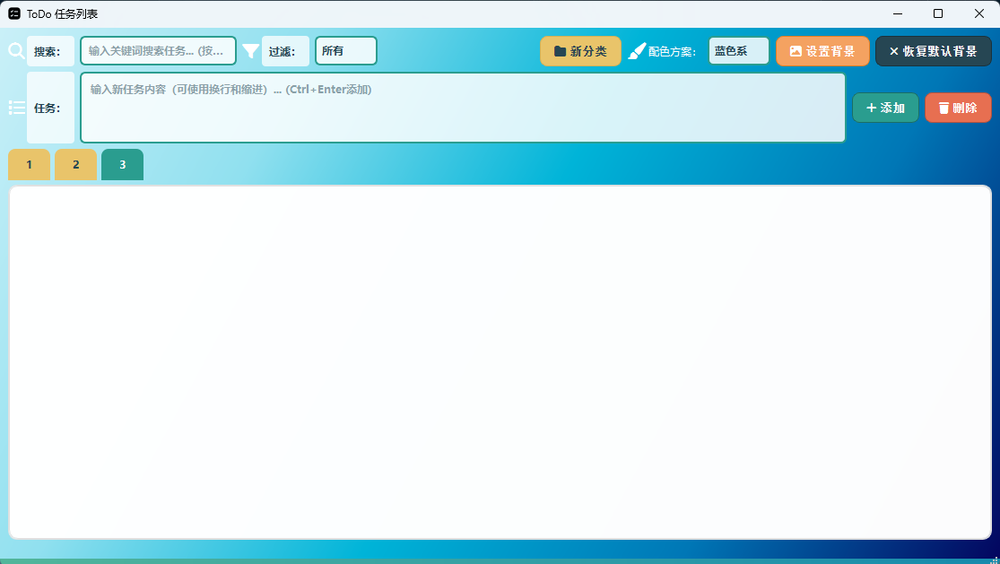

# ToDo 任务列表应用

<div align="center">


[](LICENSE)
[](RELEASE_NOTES.md)

</div>

## 项目概述

ToDo 任务列表是一个使用 Qt 框架开发的桌面应用程序，旨在帮助用户管理日常任务。该应用提供了直观的用户界面，允许用户添加、编辑、删除和标记任务，以及搜索和过滤任务列表。







## 功能特点

- ✅ **任务管理**：添加、编辑和删除任务
- ✅ **任务状态**：标记任务为已完成或未完成
- 🔍 **实时搜索功能**：输入关键词时即时过滤显示匹配的任务，也可按回车键进行搜索
- 🔖 **任务分类**：支持创建多个任务分类，更好地组织不同类型的任务
- 🎨 **智能背景**：支持自定义背景图片，自动检测暗色图片并提供提亮处理；支持多配色背景
- 💾 **数据持久化**：自动保存任务数据，应用重启后保持任务状态
- 🔄 **过滤功能**：按完成状态筛选任务（全部、未完成、已完成）
- 📱 **响应式设计**：界面会随窗口大小变化自动调整布局
- ⌨️ **快捷输入**：在任务输入框按Ctrl+Enter键即可快速添加任务
- 📝 **格式化文本**：支持输入和保存包含换行和缩进的多行文本
- 🎯 **高对比度UI**：确保界面元素在各种背景图片下都保持清晰可见

## 下载安装

### Windows

从[Releases页面](https://github.com/YourUsername/todo-app/releases)下载最新的安装包 `ToDo任务管理器_安装程序.exe`，双击运行即可完成安装。

### 从源码构建

1. 克隆仓库

   ```
   git clone https://github.com/hao1960/ToDo_app.git
   cd ToDo_app
   ```
2. 使用Qt Creator打开 `ToDo_app.pro`文件并构建项目

   或者使用命令行构建：

   ```bash
   qmake ToDo_app.pro
   mingw32-make -j4
   ```
3. 使用Inno Setup运行 `installer/ToDo_app_setup.iss` 可创建安装程序

## 使用方法

### 添加任务

1. 在"任务"输入框中输入任务内容（可包含多行文本和缩进）
2. 点击"添加"按钮或直接按Ctrl+Enter键
3. 任务将添加到当前选中的分类中

### 编辑任务

1. 双击需要编辑的任务
2. 在弹出的对话框中修改任务内容（支持多行编辑）
3. 点击"确定"保存修改

### 删除任务

1. 单击选择要删除的任务
2. 点击"删除"按钮

### 标记任务完成/未完成

- 点击任务前的复选框可切换任务状态
- 已完成的任务会显示为灰色并带有删除线

### 搜索任务

- 在"搜索"输入框中输入关键词
- 应用会实时过滤显示匹配的任务
- 也可以按回车键确认搜索
- 搜索功能会在所有分类中查找匹配的任务

### 过滤任务

- 使用"过滤"下拉菜单选择要显示的任务类型（所有、未完成、已完成）
- 过滤功能会作用于所有分类的任务

### 设置背景图片

- 点击界面上方的"设置背景"按钮
- 在文件对话框中选择本地图片文件
- 图片将被设置为应用的背景
- 如果选择的图片较暗，系统会询问是否自动提亮图片以增强可读性
- 背景设置会自动保存，下次启动应用时会自动加载
- 可随时点击"恢复默认背景"按钮返回默认渐变背景

### 设置背景颜色

* 点击“配色方案”旁边的矩形框
* 进入选择配色
* 点击喜好配色

### 管理任务分类

1. **创建新分类**:

   - 点击界面顶部的"+"按钮
   - 在弹出的对话框中输入分类名称
   - 点击"确定"创建新分类
2. **切换分类**:

   - 点击顶部的分类标签可以在不同分类之间切换
   - 每个分类都有独立的任务列表
3. **删除分类**:

   - 右键点击要删除的分类标签
   - 在弹出的菜单中选择"删除分类"

## 技术架构

- **开发框架**：Qt 5/6
- **编程语言**：C++
- **数据存储**：JSON 文件格式
- **用户界面**：Qt Widgets 布局管理器
- **设置存储**：QSettings 用于保存用户配置
- **图标库**：FontAwesome 4.7.0

## 系统要求

- **操作系统**：Windows 7/8/10/11、macOS 或 Linux
- **硬盘空间**：约50MB
- **内存**：至少256MB
- **依赖**：需要安装 Qt 运行库

## 首次运行

当你首次运行ToDo任务管理器时，应用会自动执行以下操作：

1. 创建默认分类：工作、个人、购物
2. 为每个分类创建空的任务列表
3. 创建应用程序所需的配置文件

首次运行后，你可以开始添加任务，所有数据将会保存到用户数据目录：

- Windows: `%APPDATA%\个人开发\ToDo任务管理器`
- macOS: `~/Library/Application Support/ToDo任务管理器`
- Linux: `~/.local/share/ToDo任务管理器`

## 高级功能

### 智能背景处理

应用能够自动检测用户选择的背景图片是否偏暗。如果图片整体亮度值低于阈值，系统会询问用户是否需要自动提亮处理，确保文字在任何背景下都清晰可见。

### 数据存储

#### 任务数据

应用将各个分类的任务数据分别保存在对应的JSON文件中，格式为：

```json
{
  "tasks": [
    {
      "task": "任务内容（可包含换行和缩进格式）",
      "completed": true/false
    },
    ...
  ]
}
```

#### 分类数据

分类信息使用QSettings存储，保存分类的名称列表。

#### 设置数据

用户设置（如背景图片路径）使用 Qt 的 QSettings 存储，保证应用重启后仍能保持用户的偏好设置。

## 开发环境

- **IDE**：Qt Creator
- **编译器**：MinGW 64位 (Windows)、GCC (Linux)、Clang (macOS)
- **Qt版本**：Qt 5.12+ 或 Qt 6.0+
- **C++标准**：C++17
- **构建工具**：qmake
- **安装包制作**：Inno Setup (Windows)

## 项目结构

- `main.cpp`：应用程序入口
- `mainwindow.h/cpp`：主窗口类定义和实现
- `mainwindow.ui`：用户界面设计文件
- `fonthelper.h/cpp`：字体图标帮助类
- `ToDo_app.pro`：项目配置文件
- `resources.qrc`：资源文件配置
- `installer/ToDo_app_setup.iss`：安装程序脚本
- `fonts/`：字体文件目录
- `icons/`：图标文件目录

## 贡献指南

欢迎对本项目进行贡献！请按以下步骤操作：

1. Fork本仓库
2. 创建您的特性分支 (`git checkout -b feature/amazing-feature`)
3. 提交您的更改 (`git commit -m '添加了一些很棒的功能'`)
4. 推送到分支 (`git push origin feature/amazing-feature`)
5. 开启一个Pull Request

## 更新日志

查看[CHANGELOG.md](CHANGELOG.md)获取完整的更新历史。

## 许可证

本项目采用MIT许可证 - 查看[LICENSE](LICENSE)文件了解详情。

## 联系方式

如有问题或建议，欢迎在Issues中提出，或通过以下方式联系我：

- GitHub Issues: [https://github.com/YourUsername/todo-app/issues](https://github.com/YourUsername/todo-app/issues)
- Email: your-email@example.com

## 致谢

- [Qt框架](https://www.qt.io/)
- [FontAwesome](https://fontawesome.com/)
- 所有贡献者和用户
